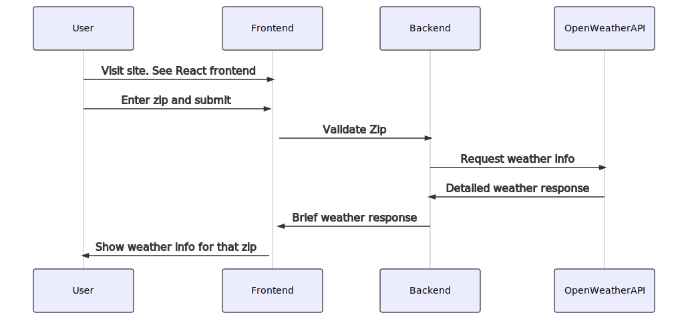
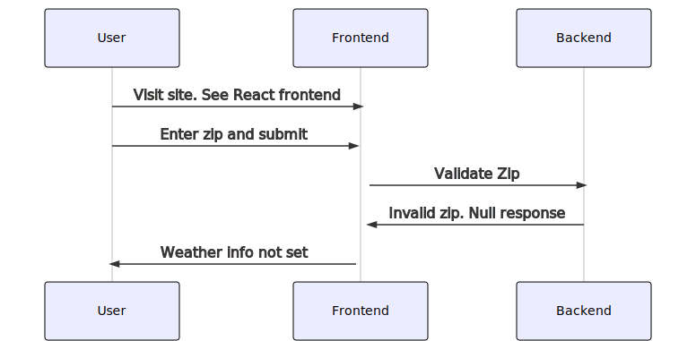
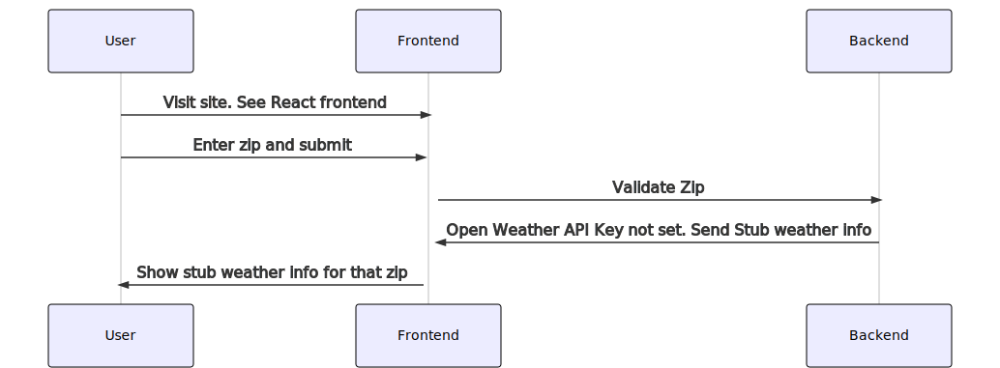

# Weather project


## Goals

Build a weather app in which frontend prompts user for a location and display weather info for that location.

1. Use MERN stack
1. Have tests
1. Production worthy
1. Can run locally
1. Doesn't use any SDK for weather API but builds one or more as needed.
1. Extensible design.
1. Easy to maintain.


## Main decisions

In the process of building such app, I made the following decisions. I'm also listing alternatives considered (with pros and cons) and reason for choosing one.

### Monorepo vs multiple repos

In the past I've used monorepo with mixed experiences. Multiple repos: one for frontend and one for backend etc is more intutive for me.
For now, I'm going to try the monorepo style one more time. But not using a tool like lerna yet. That's for post-MVP.

### Mocha vs Jest

I've used Mocha (+Chai) in the past and I like it. Jest is popular with react community. So, frontend I'll use Jest and for backend I'll use Mocha.

### Separate backend vs call api directly from frontend

From the frontend it's possible to directly call the external service. But I'm choosing to have a separate backend just for this purpose so that:

1. I can protect the sensitive information like API key etc from the front end code which anyone can read.
1. Have a reusable functionality that I can invoke from other clients in future like CLI for example.


###  Caching vs no-caching

API services for weather info don't change/update info for 10min or so (depending on the serivce) for a given location.

So, for better user experience and to reduce chances of rate limiting: I'm thinking of using Redis for cache.

For now caching is post-MVP.

### Axios vs fetch

Both are good for making external calls. Axios has more builtin functionality (timeouts, cancel request for example). But fetch can be extended to do the same.

In the backend I'm using Axios because I want to call external service and take care of timeouts, retries and too many requests cases.

In the frontend I'm using fetch because I'm keeping it simple for now and just calling the backend.

### Deploy backend and frontend as separate services vs just one server for both

By using just one service for both is very convenient: Output of react app is just static files which express JS can host besides hosting the api functionality.

But separating out frontend (nginx serving react app static files) and backend (express JS serving API) is better because they are different concerns.
They can change for different reasons. If we want to change the look of frontend, we don't need to restart API server for example.

But two services means we need a reverse proxy to avoid CORS issues. I have used traefik in the past with good results. My plan is to use traefik as reverse proxy for two services.

### Run directly vs docker

Post-MVP: To make it easy for everyone trying out the project, I'll provide a way to build docker images for frontend and backend and bring them up together with docker-compose tool. 

I'll also include details on steps to deploy locally. But docker is the preferred way to run.

### Deploy using docker-compose vs Kubernetes

In the initial iteration, I'll just run locally - instructions towards the end of this file.

post-MVP: I'll include docker-compose and also manifests needed to deploy on kubernetes.

## Develop

### Locally without docker

Need two terminals: One for frontend and one for backend

Terminal 1: ```cd projects/backend && npm install && npm run dev```

Terminal 2: ```cd projects/frontend && npm install && npm start```

Now the browser should pop up. Enter any five digit number for zip code in USA and the service will try to fetch the current, high and low temperature in F.

Backend will use either a stub weather service (by default) or Open Weather service if OPEN_WEATHER_API_KEY environment variable is set.

To use Open Weather service: Stop command running in Terminal 1 and export OPEN_WEATHER_API_KEY=<value> and then run the Terminal 1 command again.

Key for Open Weather service can be obtained from openweathermap.org for free.

## Sequence diagrams

### Typical flow when Open Weather API key is provided and zip passes validation.



### Flow when zip code fails validation



### Flow on startup or when API key is not set




